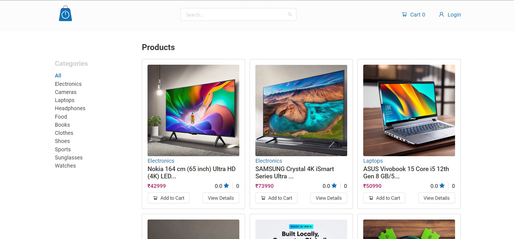

# swiftCart
SwiftCart is an e-commerce website.

## Create a file in server/config
config.env  
And place these variables  

PORT =  
NODE_ENV =  
FRONT_END_URL =  
DB_LOCAL_URI =  
JWT_SECRET =  
JWT_EXPIRATION_TIME =  
COOKIE_EXPIRES_TIME =  
SMTP_HOST =  
SMTP_MAIL =  
SMTP_PASS =  
MAIL_FROM =  
MAIL_SENT =  
STRIPE_API_KEY =  
STRIPE_SECRET_KEY =  

## Install the required dependencies
In client directory  
npm install  
 
In server directory  
npm install  

## Run this command on terminal
In client directory  
npm run dev  
 
In server directory  
npm run prod  

## The webpage will appears like:
